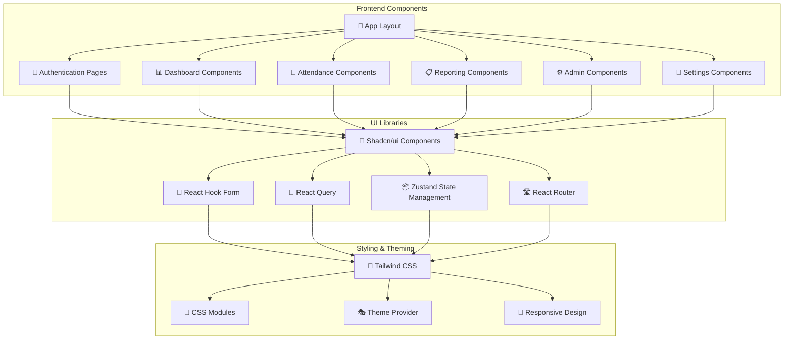
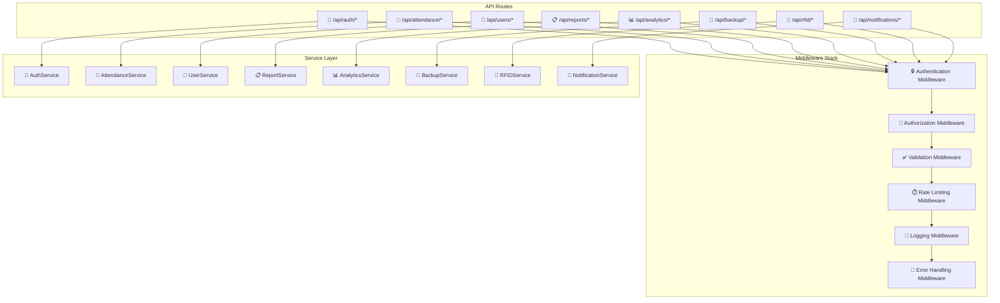
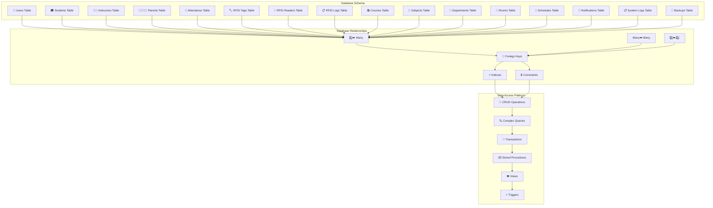
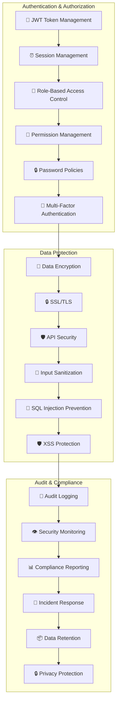
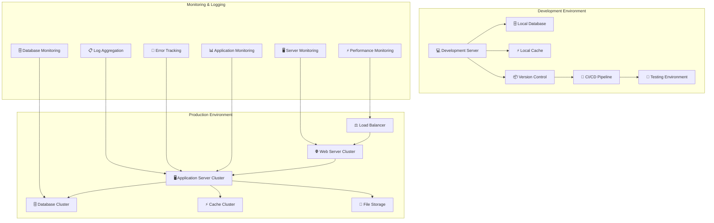

# ICCT Smart Attendance System - System Architecture Diagram

## Overview
This document presents a comprehensive System Architecture Diagram for the ICCT Smart Attendance System, showing the technical layers, components, and their interactions with proper Mermaid icons and images.

## System Architecture Diagram with Icons

```mermaid
graph TB
    subgraph "Client Layer"
        A["🌐 Web Browser"]
        B["📱 RFID Reader Hardware"]
        C["📧 Email Client"]
    end
    
    subgraph "Presentation Layer"
        D["⚛️ Next.js Frontend"]
        E["🔧 React Components"]
        F["🎨 UI Components"]
        G["🔐 Authentication UI"]
        H["📊 Dashboard UI"]
        I["📋 Reports UI"]
        J["⚙️ Admin UI"]
    end
    
    subgraph "API Gateway Layer"
        K["🔗 Next.js API Routes"]
        L["🔒 Authentication Middleware"]
        M["⏱️ Rate Limiting"]
        N["🌍 CORS Configuration"]
        O["✅ Request Validation"]
    end
    
    subgraph "Application Layer"
        P["🔑 Authentication Service"]
        Q["📝 Attendance Service"]
        R["👥 User Management Service"]
        S["🔔 Notification Service"]
        T["📈 Reporting Service"]
        U["📊 Analytics Service"]
        V["💾 Backup Service"]
        W["🛡️ Security Service"]
    end
    
    subgraph "Business Logic Layer"
        X["📋 Attendance Processing"]
        Y["🏷️ RFID Tag Management"]
        Z["📅 Schedule Management"]
        AA["👤 Role Management"]
        BB["🔐 Permission Control"]
        CC["✅ Data Validation"]
        DD["⚙️ Business Rules Engine"]
    end
    
    subgraph "Data Access Layer"
        EE["🗄️ Prisma ORM"]
        FF["🔄 Database Migrations"]
        GG["⚡ Query Optimization"]
        HH["🔗 Connection Pooling"]
    end
    
    subgraph "Data Storage Layer"
        II["🐘 PostgreSQL Database"]
        JJ["⚡ Redis Cache"]
        KK["📁 File Storage"]
        LL["💾 Backup Storage"]
    end
    
    subgraph "External Services Layer"
        MM["📧 Email Service"]
        NN["📡 RFID Hardware API"]
        OO["🔌 External APIs"]
        PP["🔗 Webhook Services"]
    end
    
    subgraph "Infrastructure Layer"
        QQ["⚖️ Load Balancer"]
        RR["🌐 Web Server"]
        SS["🖥️ Application Server"]
        TT["🗄️ Database Server"]
        UU["⚡ Cache Server"]
        VV["📁 File Server"]
    end
    
    subgraph "Security Layer"
        WW["🔑 JWT Authentication"]
        XX["🛡️ CSRF Protection"]
        YY["✅ Input Validation"]
        ZZ["🔒 SQL Injection Prevention"]
        AAA["🛡️ XSS Protection"]
        BBB["⏱️ Rate Limiting"]
        CCC["📝 Audit Logging"]
    end
    
    subgraph "Monitoring Layer"
        DDD["📊 System Monitoring"]
        EEE["⚡ Performance Monitoring"]
        FFF["🚨 Error Tracking"]
        GGG["💚 Health Checks"]
        HHH["📋 Log Management"]
    end
    
    %% Client Layer Connections
    A --> D
    B --> NN
    C --> MM
    
    %% Presentation Layer Connections
    D --> K
    E --> D
    F --> E
    G --> P
    H --> Q
    I --> T
    J --> R
    
    %% API Gateway Layer Connections
    K --> L
    K --> M
    K --> N
    K --> O
    L --> P
    M --> BBB
    O --> YY
    
    %% Application Layer Connections
    P --> X
    Q --> X
    R --> AA
    S --> MM
    T --> U
    U --> JJ
    V --> LL
    W --> CCC
    
    %% Business Logic Layer Connections
    X --> Y
    X --> Z
    Y --> NN
    Z --> AA
    AA --> BB
    BB --> CC
    CC --> DD
    
    %% Data Access Layer Connections
    EE --> FF
    EE --> GG
    EE --> HH
    EE --> II
    EE --> JJ
    
    %% Data Storage Layer Connections
    II --> TT
    JJ --> UU
    KK --> VV
    LL --> VV
    
    %% External Services Layer Connections
    MM --> QQ
    NN --> QQ
    OO --> QQ
    PP --> QQ
    
    %% Infrastructure Layer Connections
    QQ --> RR
    RR --> SS
    SS --> TT
    SS --> UU
    SS --> VV
    
    %% Security Layer Connections
    WW --> L
    XX --> O
    YY --> O
    ZZ --> EE
    AAA --> F
    BBB --> M
    CCC --> HHH
    
    %% Monitoring Layer Connections
    DDD --> SS
    EEE --> SS
    FFF --> SS
    GGG --> SS
    HHH --> SS
    
    %% Styling with Icons
    classDef clientLayer fill:#e3f2fd,stroke:#1976d2,stroke-width:2px
    classDef presentationLayer fill:#f3e5f5,stroke:#7b1fa2,stroke-width:2px
    classDef apiGatewayLayer fill:#e8f5e8,stroke:#388e3c,stroke-width:2px
    classDef applicationLayer fill:#fff3e0,stroke:#f57c00,stroke-width:2px
    classDef businessLogicLayer fill:#fce4ec,stroke:#c2185b,stroke-width:2px
    classDef dataAccessLayer fill:#e0f2f1,stroke:#00695c,stroke-width:2px
    classDef dataStorageLayer fill:#f1f8e9,stroke:#558b2f,stroke-width:2px
    classDef externalServicesLayer fill:#e8eaf6,stroke:#3f51b5,stroke-width:2px
    classDef infrastructureLayer fill:#fff8e1,stroke:#f57f17,stroke-width:2px
    classDef securityLayer fill:#ffebee,stroke:#c62828,stroke-width:2px
    classDef monitoringLayer fill:#e0f7fa,stroke:#00838f,stroke-width:2px
    
    class A,B,C clientLayer
    class D,E,F,G,H,I,J presentationLayer
    class K,L,M,N,O apiGatewayLayer
    class P,Q,R,S,T,U,V,W applicationLayer
    class X,Y,Z,AA,BB,CC,DD businessLogicLayer
    class EE,FF,GG,HH dataAccessLayer
    class II,JJ,KK,LL dataStorageLayer
    class MM,NN,OO,PP externalServicesLayer
    class QQ,RR,SS,TT,UU,VV infrastructureLayer
    class WW,XX,YY,ZZ,AAA,BBB,CCC securityLayer
    class DDD,EEE,FFF,GGG,HHH monitoringLayer
```

## System Architecture with Mermaid Icons and Images

## Detailed Component Architecture

### 1. Frontend Architecture

### 2. Backend API Architecture

### 3. Database Architecture

### 4. Security Architecture

### 5. Deployment Architecture

## Architecture Components Description

### 1. **Client Layer**
- **🌐 Web Browser**: Modern browsers with JavaScript enabled
- **📱 RFID Reader Hardware**: Physical RFID scanning devices
- **📧 Email Client**: External email applications for notifications

### 2. **Presentation Layer**
- **⚛️ Next.js Frontend**: React-based frontend framework
- **🔧 React Components**: Reusable UI components
- **🎨 UI Components**: Custom and third-party UI elements
- **🔐 Authentication UI**: Login, registration, and password reset forms
- **📊 Dashboard UI**: Role-specific dashboards
- **📋 Reports UI**: Report generation and viewing interfaces
- **⚙️ Admin UI**: Administrative management interfaces

### 3. **API Gateway Layer**
- **🔗 Next.js API Routes**: RESTful API endpoints
- **🔒 Authentication Middleware**: JWT token validation
- **⏱️ Rate Limiting**: Request throttling and protection
- **🌍 CORS Configuration**: Cross-origin resource sharing
- **✅ Request Validation**: Input validation and sanitization

### 4. **Application Layer**
- **🔑 Authentication Service**: User authentication and authorization
- **📝 Attendance Service**: Attendance processing and management
- **👥 User Management Service**: User CRUD operations
- **🔔 Notification Service**: Email and web notification handling
- **📈 Reporting Service**: Report generation and export
- **📊 Analytics Service**: Data analysis and insights
- **💾 Backup Service**: Automated backup and recovery
- **🛡️ Security Service**: Security monitoring and compliance

### 5. **Business Logic Layer**
- **📋 Attendance Processing**: Core attendance logic and rules
- **🏷️ RFID Tag Management**: RFID tag assignment and tracking
- **📅 Schedule Management**: Class and room scheduling
- **👤 Role Management**: User role and permission management
- **🔐 Permission Control**: Access control and authorization
- **✅ Data Validation**: Business rule validation
- **⚙️ Business Rules Engine**: Complex business logic processing

### 6. **Data Access Layer**
- **🗄️ Prisma ORM**: Object-relational mapping
- **🔄 Database Migrations**: Schema version control
- **⚡ Query Optimization**: Performance optimization
- **🔗 Connection Pooling**: Database connection management

### 7. **Data Storage Layer**
- **🐘 PostgreSQL Database**: Primary relational database
- **⚡ Redis Cache**: In-memory caching layer
- **📁 File Storage**: Document and backup storage
- **💾 Backup Storage**: Secure backup repository

### 8. **External Services Layer**
- **📧 Email Service**: External email delivery service
- **📡 RFID Hardware API**: RFID device integration
- **🔌 External APIs**: Third-party system integrations
- **🔗 Webhook Services**: Real-time data synchronization

### 9. **Infrastructure Layer**
- **⚖️ Load Balancer**: Traffic distribution and high availability
- **🌐 Web Server**: HTTP request handling
- **🖥️ Application Server**: Business logic execution
- **🗄️ Database Server**: Data persistence and retrieval
- **⚡ Cache Server**: Performance optimization
- **📁 File Server**: File storage and retrieval

### 10. **Security Layer**
- **🔑 JWT Authentication**: Token-based authentication
- **🛡️ CSRF Protection**: Cross-site request forgery prevention
- **✅ Input Validation**: Data validation and sanitization
- **🔒 SQL Injection Prevention**: Database security
- **🛡️ XSS Protection**: Cross-site scripting prevention
- **⏱️ Rate Limiting**: Request throttling
- **📝 Audit Logging**: Security event logging

### 11. **Monitoring Layer**
- **📊 System Monitoring**: Overall system health monitoring
- **⚡ Performance Monitoring**: Application performance tracking
- **🚨 Error Tracking**: Error detection and reporting
- **💚 Health Checks**: System availability monitoring
- **📋 Log Management**: Centralized log collection and analysis

## Key Architecture Benefits

### 1. **Scalability**
- Horizontal scaling capabilities
- Load balancing and clustering
- Caching strategies for performance
- Database optimization and indexing

### 2. **Security**
- Multi-layer security approach
- Authentication and authorization at every layer
- Data encryption and protection
- Comprehensive audit logging

### 3. **Reliability**
- High availability design
- Automated backup and recovery
- Error handling and monitoring
- Health checks and alerting

### 4. **Maintainability**
- Modular component design
- Clear separation of concerns
- Standardized interfaces
- Comprehensive documentation

### 5. **Performance**
- Optimized database queries
- Caching strategies
- CDN integration
- Load balancing

### 6. **Flexibility**
- API-first design
- External service integration
- Configurable components
- Extensible architecture

This System Architecture Diagram provides a comprehensive view of the ICCT Smart Attendance System's technical structure, showing how different components interact and how the system is organized for scalability, security, and maintainability with enhanced visual representation using icons and emojis.
