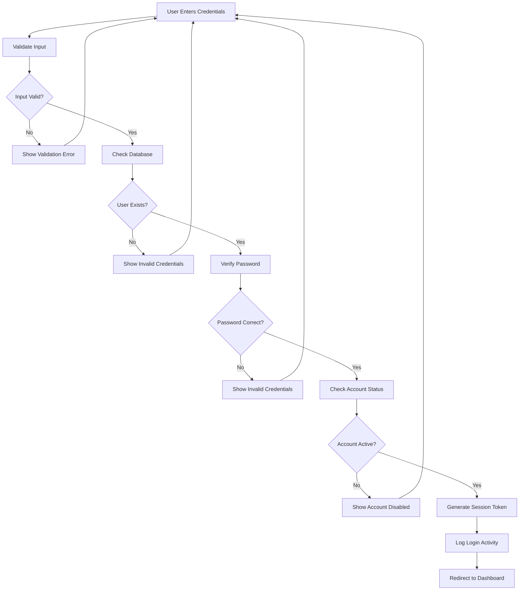
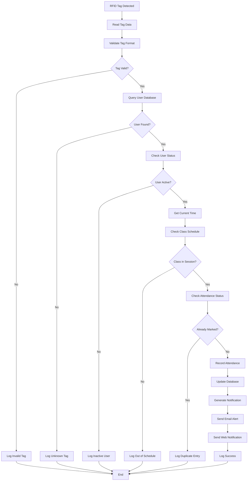
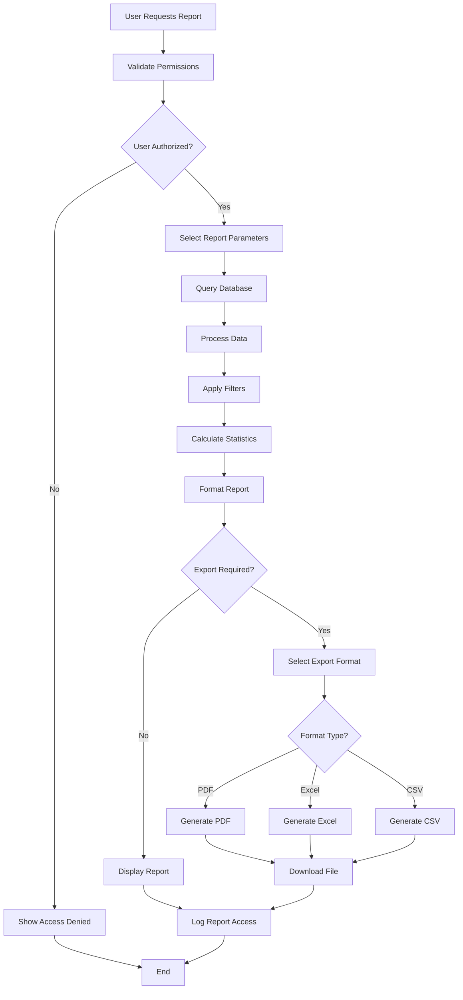
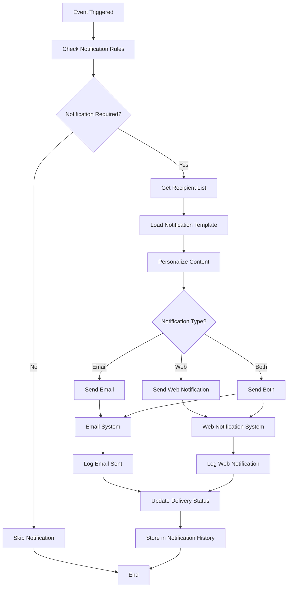
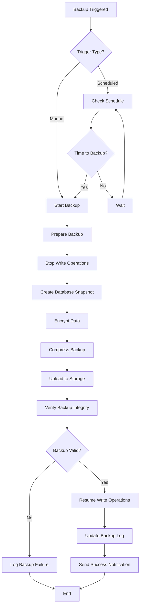

# ICCT Smart Attendance System - System Flowchart

## Overview
This document presents a comprehensive System Flowchart for the ICCT Smart Attendance System, showing the logical flow of operations, decision points, and system processes.

## Main System Flowchart

```mermaid
flowchart TD
    A[Start] --> B[User Access System]
    B --> C{User Type?}
    
    C -->|Student| D[Student Login]
    C -->|Instructor| E[Instructor Login]
    C -->|Parent| F[Parent Login]
    C -->|Admin| G[Admin Login]
    C -->|System Admin| H[SysAdmin Login]
    
    %% Student Flow
    D --> I{Authentication Valid?}
    I -->|No| J[Show Error Message]
    J --> D
    I -->|Yes| K[Student Dashboard]
    K --> L{Student Action?}
    L -->|View Attendance| M[Display Personal Attendance]
    L -->|View Schedule| N[Display Class Schedule]
    L -->|View Courses| O[Display Course Information]
    L -->|Logout| P[End Session]
    
    %% Instructor Flow
    E --> Q{Authentication Valid?}
    Q -->|No| R[Show Error Message]
    R --> E
    Q -->|Yes| S[Instructor Dashboard]
    S --> T{Instructor Action?}
    T -->|View Class Attendance| U[Display Class Attendance]
    T -->|Generate Reports| V[Generate Class Reports]
    T -->|Manage Schedule| W[Update Class Schedule]
    T -->|Manual Attendance| X[Mark Manual Attendance]
    T -->|View Students| Y[Display Student List]
    T -->|Logout| Z[End Session]
    
    %% Parent Flow
    F --> AA{Authentication Valid?}
    AA -->|No| BB[Show Error Message]
    BB --> F
    AA -->|Yes| CC[Parent Dashboard]
    CC --> DD{Parent Action?}
    DD -->|View Child Attendance| EE[Display Child Attendance]
    DD -->|View Progress| FF[Display Academic Progress]
    DD -->|Update Contact| GG[Update Contact Information]
    DD -->|Logout| HH[End Session]
    
    %% Admin Flow
    G --> II{Authentication Valid?}
    II -->|No| JJ[Show Error Message]
    JJ --> G
    II -->|Yes| KK[Admin Dashboard]
    KK --> LL{Admin Action?}
    LL -->|Manage Users| MM[User Management System]
    LL -->|Manage Departments| NN[Department Management]
    LL -->|Manage Courses| OO[Course Management]
    LL -->|System Reports| PP[Generate System Reports]
    LL -->|System Analytics| QQ[View System Analytics]
    LL -->|Logout| RR[End Session]
    
    %% System Admin Flow
    H --> SS{Authentication Valid?}
    SS -->|No| TT[Show Error Message]
    TT --> H
    SS -->|Yes| UU[SysAdmin Dashboard]
    UU --> VV{SysAdmin Action?}
    VV -->|System Backups| WW[Backup Management]
    VV -->|System Health| XX[System Monitoring]
    VV -->|Security Settings| YY[Security Configuration]
    VV -->|API Management| ZZ[API Integration Management]
    VV -->|Logout| AAA[End Session]
    
    %% RFID Attendance Flow
    BBB[RFID Tag Scanned] --> CCC{Tag Valid?}
    CCC -->|No| DDD[Log Invalid Tag]
    CCC -->|Yes| EEE[Identify User]
    EEE --> FFF{User Found?}
    FFF -->|No| GGG[Log Unknown User]
    FFF -->|Yes| HHH[Check Schedule]
    HHH --> III{Class in Session?}
    III -->|No| JJJ[Log Out of Schedule]
    III -->|Yes| KKK[Record Attendance]
    KKK --> LLL[Update Database]
    LLL --> MMM[Generate Notification]
    MMM --> NNN[Send Email Alert]
    NNN --> OOO[Send Web Notification]
    
    %% Manual Attendance Flow
    X --> PPP{Select Student}
    PPP --> QQQ{Student Present?}
    QQQ -->|Yes| RRR[Mark Present]
    QQQ -->|No| SSS[Mark Absent]
    RRR --> TTT[Update Attendance Record]
    SSS --> TTT
    TTT --> UUU[Save to Database]
    UUU --> VVV[Generate Report]
    
    %% Report Generation Flow
    V --> WWW{Report Type?}
    WWW -->|Daily| XXX[Generate Daily Report]
    WWW -->|Weekly| YYY[Generate Weekly Report]
    WWW -->|Monthly| ZZZ[Generate Monthly Report]
    WWW -->|Custom| AAAA[Generate Custom Report]
    XXX --> BBBB[Format Report]
    YYY --> BBBB
    ZZZ --> BBBB
    AAAA --> BBBB
    BBBB --> CCCC{Export Format?}
    CCCC -->|PDF| DDDD[Export as PDF]
    CCCC -->|Excel| EEEE[Export as Excel]
    CCCC -->|CSV| FFFF[Export as CSV]
    
    %% Notification System Flow
    MMM --> GGGG{Notification Type?}
    GGGG -->|Absence Alert| HHHH[Send Absence Email]
    GGGG -->|Attendance Confirmation| IIII[Send Confirmation]
    GGGG -->|System Alert| JJJJ[Send System Alert]
    HHHH --> KKKK[Email System]
    IIII --> KKKK
    JJJJ --> KKKK
    OOO --> LLLL[Web Notification System]
    
    %% Database Operations Flow
    LLL --> MMMM[Prisma ORM]
    MMMM --> NNNN[PostgreSQL Database]
    NNNN --> OOOO[Commit Transaction]
    OOOO --> PPPP[Update Cache]
    PPPP --> QQQQ[Log Operation]
    
    %% System Monitoring Flow
    XX --> RRRR{System Status?}
    RRRR -->|Healthy| SSSS[Continue Monitoring]
    RRRR -->|Warning| TTTT[Send Warning Alert]
    RRRR -->|Critical| UUUU[Send Critical Alert]
    TTTT --> VVVV[Admin Notification]
    UUUU --> VVVV
    VVVV --> WWWW[System Log]
    
    %% Backup System Flow
    WW --> XXXX{Scheduled Backup?}
    XXXX -->|Yes| YYYY[Start Backup Process]
    XXXX -->|Manual| YYYY
    YYYY --> ZZZZ[Encrypt Data]
    ZZZZ --> AAAAA[Compress Backup]
    AAAAA --> BBBBB[Store Backup]
    BBBBB --> CCCCC[Verify Backup]
    CCCCC --> DDDDD[Log Backup Status]
    
    %% End Points
    P --> END[End]
    Z --> END
    HH --> END
    RR --> END
    AAA --> END
    
    %% Styling
    classDef startEnd fill:#e1f5fe,stroke:#01579b,stroke-width:2px
    classDef process fill:#f3e5f5,stroke:#4a148c,stroke-width:2px
    classDef decision fill:#fff3e0,stroke:#e65100,stroke-width:2px
    classDef database fill:#e8f5e8,stroke:#1b5e20,stroke-width:2px
    classDef notification fill:#fff8e1,stroke:#f57f17,stroke-width:2px
    classDef error fill:#ffebee,stroke:#c62828,stroke-width:2px
    
    class A,END startEnd
    class B,D,E,F,G,H,K,S,CC,KK,UU,BBB,LLL,KKK,TTT,BBBB,MMMM,YYYY process
    class C,I,Q,AA,II,SS,L,T,DD,LL,VV,CCC,FFF,III,QQQ,WWW,GGGG,RRRR,XXXX decision
    class NNNN,WWWW,DDDDD database
    class MMM,OOO,NNN,HHHH,IIII,JJJJ notification
    class J,R,BB,JJ,TT,DDD,GGG,JJJ error
```

## Detailed Process Flowcharts

### 1. Authentication Flow

### 2. RFID Attendance Processing Flow

### 3. Report Generation Flow

### 4. Notification System Flow

### 5. System Backup Flow

## System Flowchart Key Features

### 1. **Multi-User Authentication Flow**
- Separate login processes for different user types
- Comprehensive validation and error handling
- Session management and security logging

### 2. **RFID Attendance Processing**
- Automatic tag detection and validation
- Real-time attendance recording
- Duplicate entry prevention
- Schedule-based validation

### 3. **Comprehensive Reporting System**
- Multiple report types and formats
- Permission-based access control
- Export functionality in various formats
- Audit logging for report access

### 4. **Notification Management**
- Event-driven notification system
- Multiple delivery channels (Email & Web)
- Template-based personalization
- Delivery status tracking

### 5. **System Administration**
- Automated backup procedures
- System health monitoring
- Security configuration management
- API integration management

### 6. **Database Operations**
- Prisma ORM integration
- PostgreSQL database management
- Transaction handling
- Cache management

## Benefits of This Flowchart Design

1. **Clear Process Visualization**: Easy to understand system workflows
2. **Decision Point Identification**: Clear branching logic and conditions
3. **Error Handling**: Comprehensive error scenarios and recovery
4. **Scalable Architecture**: Modular design for easy maintenance
5. **Security Integration**: Authentication and authorization at each step
6. **Audit Trail**: Complete logging and monitoring capabilities
7. **User-Centric Design**: Focuses on user interactions and needs

This System Flowchart provides a complete view of how the ICCT Smart Attendance System processes data, handles user interactions, and manages system operations, making it easy for stakeholders to understand the system's logical flow and identify potential areas for optimization or enhancement.
