# ICCT Smart Attendance System - Use Case Diagram (Mermaid)

## Overview
This document presents a comprehensive Use Case Diagram for the ICCT Smart Attendance System using Mermaid, showing all major actors and their interactions with the system.

## Use Case Diagram

```mermaid
graph TB
    %% Actors
    Student[👤 Student]
    Instructor[👨‍🏫 Instructor]
    Parent[👨‍👩‍👧‍👦 Parent/Guardian]
    Admin[👨‍💼 Admin]
    SysAdmin[🔧 System Administrator]
    RFIDReader[📡 RFID Reader]
    EmailSystem[📧 Email System]
    ExternalAPI[🌐 External API]

    %% System Boundary
    subgraph "ICCT Smart Attendance System"
        %% Authentication & Security Use Cases
        UC1[Login to System]
        UC2[Logout from System]
        UC3[Reset Password]
        UC4[Manage User Profile]
        UC5[Change Password]
        UC6[View Dashboard]

        %% RFID & Attendance Use Cases
        UC7[Scan RFID Tag]
        UC8[Record Attendance]
        UC9[View Attendance History]
        UC10[Generate Attendance Report]
        UC11[Export Attendance Data]
        UC12[Manage RFID Tags]
        UC13[Manage RFID Readers]

        %% Student-Specific Use Cases
        UC14[View Personal Attendance]
        UC15[View Class Schedule]
        UC16[View Course Information]
        UC17[Receive Notifications]

        %% Instructor-Specific Use Cases
        UC18[View Class Attendance]
        UC19[Manage Class Schedule]
        UC20[Generate Class Reports]
        UC21[View Student List]
        UC22[Mark Manual Attendance]
        UC23[View Teaching Schedule]

        %% Parent-Specific Use Cases
        UC24[View Child Attendance]
        UC25[Receive Absence Alerts]
        UC26[View Academic Progress]
        UC27[Update Contact Information]

        %% Admin Use Cases
        UC28[Manage Users]
        UC29[Manage Departments]
        UC30[Manage Courses]
        UC31[Manage Subjects]
        UC32[Manage Instructors]
        UC33[Manage Students]
        UC34[Manage Parents]
        UC35[Manage Rooms]
        UC36[Manage Schedules]
        UC37[View System Analytics]
        UC38[Generate System Reports]
        UC39[Manage System Settings]
        UC40[View Audit Logs]
        UC41[Manage Roles & Permissions]

        %% System Administrator Use Cases
        UC42[Manage System Backups]
        UC43[Monitor System Health]
        UC44[Manage Security Settings]
        UC45[View System Logs]
        UC46[Manage API Integrations]
        UC47[Configure Notifications]
        UC48[Manage Database]
        UC49[Perform System Maintenance]

        %% Notification Use Cases
        UC50[Send Email Notifications]
        UC51[Send Web Notifications]
        UC52[Manage Notification Templates]
        UC53[Schedule Notifications]

        %% Analytics & Reporting Use Cases
        UC54[Generate Analytics Reports]
        UC55[View Real-time Analytics]
        UC56[Export Reports]
        UC57[View Performance Metrics]

        %% External System Use Cases
        UC58[Sync External Data]
        UC59[Process Webhooks]
        UC60[API Data Exchange]
    end

    %% Student Relationships
    Student --> UC1
    Student --> UC2
    Student --> UC3
    Student --> UC4
    Student --> UC5
    Student --> UC6
    Student --> UC14
    Student --> UC15
    Student --> UC16
    Student --> UC17

    %% Instructor Relationships
    Instructor --> UC1
    Instructor --> UC2
    Instructor --> UC3
    Instructor --> UC4
    Instructor --> UC5
    Instructor --> UC6
    Instructor --> UC18
    Instructor --> UC19
    Instructor --> UC20
    Instructor --> UC21
    Instructor --> UC22
    Instructor --> UC23
    Instructor --> UC17

    %% Parent Relationships
    Parent --> UC1
    Parent --> UC2
    Parent --> UC3
    Parent --> UC4
    Parent --> UC5
    Parent --> UC6
    Parent --> UC24
    Parent --> UC25
    Parent --> UC26
    Parent --> UC27
    Parent --> UC17

    %% Admin Relationships
    Admin --> UC1
    Admin --> UC2
    Admin --> UC3
    Admin --> UC4
    Admin --> UC5
    Admin --> UC6
    Admin --> UC28
    Admin --> UC29
    Admin --> UC30
    Admin --> UC31
    Admin --> UC32
    Admin --> UC33
    Admin --> UC34
    Admin --> UC35
    Admin --> UC36
    Admin --> UC37
    Admin --> UC38
    Admin --> UC39
    Admin --> UC40
    Admin --> UC41
    Admin --> UC17

    %% System Administrator Relationships
    SysAdmin --> UC1
    SysAdmin --> UC2
    SysAdmin --> UC3
    SysAdmin --> UC4
    SysAdmin --> UC5
    SysAdmin --> UC6
    SysAdmin --> UC42
    SysAdmin --> UC43
    SysAdmin --> UC44
    SysAdmin --> UC45
    SysAdmin --> UC46
    SysAdmin --> UC47
    SysAdmin --> UC48
    SysAdmin --> UC49
    SysAdmin --> UC17

    %% RFID Reader Relationships
    RFIDReader --> UC7
    RFIDReader --> UC8

    %% Email System Relationships
    EmailSystem --> UC50

    %% External API Relationships
    ExternalAPI --> UC58
    ExternalAPI --> UC59
    ExternalAPI --> UC60

    %% Include Relationships (dashed lines)
    UC8 -.-> UC7
    UC8 -.-> UC50
    UC8 -.-> UC51
    UC25 -.-> UC50
    UC17 -.-> UC51
    UC38 -.-> UC54
    UC37 -.-> UC55
    UC20 -.-> UC10
    UC42 -.-> UC48

    %% Extend Relationships (dotted lines)
    UC50 -.-> UC52
    UC51 -.-> UC52
    UC53 -.-> UC50
    UC53 -.-> UC51
    UC56 -.-> UC54
    UC57 -.-> UC55

    %% Styling
    classDef actor fill:#e1f5fe,stroke:#01579b,stroke-width:2px
    classDef useCase fill:#f3e5f5,stroke:#4a148c,stroke-width:1px
    classDef systemBoundary fill:#fff3e0,stroke:#e65100,stroke-width:3px

    class Student,Instructor,Parent,Admin,SysAdmin,RFIDReader,EmailSystem,ExternalAPI actor
    class UC1,UC2,UC3,UC4,UC5,UC6,UC7,UC8,UC9,UC10,UC11,UC12,UC13,UC14,UC15,UC16,UC17,UC18,UC19,UC20,UC21,UC22,UC23,UC24,UC25,UC26,UC27,UC28,UC29,UC30,UC31,UC32,UC33,UC34,UC35,UC36,UC37,UC38,UC39,UC40,UC41,UC42,UC43,UC44,UC45,UC46,UC47,UC48,UC49,UC50,UC51,UC52,UC53,UC54,UC55,UC56,UC57,UC58,UC59,UC60 useCase
```

## Alternative Simplified View

For better readability, here's a simplified version focusing on main actor interactions:

```mermaid
graph LR
    %% Actors
    Student[👤 Student]
    Instructor[👨‍🏫 Instructor]
    Parent[👨‍👩‍👧‍👦 Parent]
    Admin[👨‍💼 Admin]
    SysAdmin[🔧 SysAdmin]

    %% Main Use Case Categories
    Auth[🔐 Authentication]
    Attendance[📊 Attendance Management]
    StudentUC[📚 Student Functions]
    InstructorUC[👨‍🏫 Instructor Functions]
    ParentUC[👨‍👩‍👧‍👦 Parent Functions]
    AdminUC[⚙️ Admin Functions]
    SysAdminUC[🔧 System Admin Functions]
    Notifications[📢 Notifications]
    Analytics[📈 Analytics & Reports]

    %% Relationships
    Student --> Auth
    Student --> Attendance
    Student --> StudentUC
    Student --> Notifications

    Instructor --> Auth
    Instructor --> Attendance
    Instructor --> InstructorUC
    Instructor --> Notifications

    Parent --> Auth
    Parent --> ParentUC
    Parent --> Notifications

    Admin --> Auth
    Admin --> AdminUC
    Admin --> Analytics
    Admin --> Notifications

    SysAdmin --> Auth
    SysAdmin --> SysAdminUC
    SysAdmin --> Analytics

    %% Styling
    classDef actor fill:#e1f5fe,stroke:#01579b,stroke-width:2px
    classDef category fill:#f3e5f5,stroke:#4a148c,stroke-width:1px

    class Student,Instructor,Parent,Admin,SysAdmin actor
    class Auth,Attendance,StudentUC,InstructorUC,ParentUC,AdminUC,SysAdminUC,Notifications,Analytics category
```

## Use Case Categories Breakdown

## Actor Descriptions

### Primary Actors
1. **Student**: End users who attend classes and have RFID tags for attendance tracking
2. **Instructor**: Faculty members who teach classes and manage student attendance
3. **Parent/Guardian**: Legal guardians who monitor their children's attendance and academic progress
4. **Admin**: Administrative staff who manage the overall system operations
5. **System Administrator**: Technical staff responsible for system maintenance and configuration

### Secondary Actors
6. **RFID Reader**: Hardware device that scans RFID tags and sends data to the system
7. **Email System**: External email service for sending notifications
8. **External API**: Third-party systems that integrate with the attendance system

## Use Case Categories

### 1. Authentication & Security
- **Login to System**: All users must authenticate to access the system
- **Logout from System**: Secure session termination
- **Reset Password**: Password recovery functionality
- **Manage User Profile**: Update personal information
- **Change Password**: Password modification
- **View Dashboard**: Access to personalized dashboard

### 2. RFID & Attendance Management
- **Scan RFID Tag**: Automatic attendance recording via RFID
- **Record Attendance**: Store attendance data in the system
- **View Attendance History**: Access historical attendance records
- **Generate Attendance Report**: Create attendance reports
- **Export Attendance Data**: Export data in various formats
- **Manage RFID Tags**: Administer RFID tag assignments
- **Manage RFID Readers**: Configure and monitor RFID readers

### 3. Student-Specific Functions
- **View Personal Attendance**: Students can see their own attendance records
- **View Class Schedule**: Access to class timetables
- **View Course Information**: Course details and materials
- **Receive Notifications**: Get alerts about attendance and academic matters

### 4. Instructor-Specific Functions
- **View Class Attendance**: Monitor student attendance in their classes
- **Manage Class Schedule**: Update and modify class schedules
- **Generate Class Reports**: Create reports for their classes
- **View Student List**: Access roster of enrolled students
- **Mark Manual Attendance**: Override RFID attendance when needed
- **View Teaching Schedule**: Access their teaching timetable

### 5. Parent-Specific Functions
- **View Child Attendance**: Monitor their children's attendance
- **Receive Absence Alerts**: Get notified when children are absent
- **View Academic Progress**: Access academic performance data
- **Update Contact Information**: Maintain current contact details

### 6. Administrative Functions
- **Manage Users**: Create, update, and delete user accounts
- **Manage Departments**: Handle department information
- **Manage Courses**: Administer course offerings
- **Manage Subjects**: Handle subject information
- **Manage Instructors**: Administer instructor accounts
- **Manage Students**: Handle student records
- **Manage Parents**: Administer parent accounts
- **Manage Rooms**: Handle classroom assignments
- **Manage Schedules**: Coordinate class schedules
- **View System Analytics**: Access system-wide analytics
- **Generate System Reports**: Create comprehensive reports
- **Manage System Settings**: Configure system parameters
- **View Audit Logs**: Monitor system activities
- **Manage Roles & Permissions**: Control access rights

### 7. System Administration
- **Manage System Backups**: Handle data backup operations
- **Monitor System Health**: Track system performance
- **Manage Security Settings**: Configure security parameters
- **View System Logs**: Access system logs
- **Manage API Integrations**: Handle external integrations
- **Configure Notifications**: Set up notification systems
- **Manage Database**: Handle database operations
- **Perform System Maintenance**: Conduct system maintenance

### 8. Notification System
- **Send Email Notifications**: Deliver notifications via email
- **Send Web Notifications**: Deliver in-app notifications
- **Manage Notification Templates**: Create and edit notification templates
- **Schedule Notifications**: Set up automated notifications

### 9. Analytics & Reporting
- **Generate Analytics Reports**: Create analytical reports
- **View Real-time Analytics**: Access live analytics data
- **Export Reports**: Export reports in various formats
- **View Performance Metrics**: Access performance indicators

### 10. External System Integration
- **Sync External Data**: Synchronize with external systems
- **Process Webhooks**: Handle incoming webhook data
- **API Data Exchange**: Exchange data via APIs

## Key Features Highlighted

### 1. **Multi-Role Access Control**
- Different access levels for different user types
- Role-based permissions and restrictions
- Secure authentication and authorization

### 2. **Automated Attendance Tracking**
- RFID-based automatic attendance recording
- Manual attendance override capabilities
- Real-time attendance monitoring

### 3. **Comprehensive Reporting**
- Multiple report types for different stakeholders
- Export capabilities in various formats
- Real-time analytics and dashboards

### 4. **Notification System**
- Email notifications for important events
- Web-based in-app notifications
- Configurable notification templates

### 5. **System Management**
- Complete user and data management
- System monitoring and maintenance
- Backup and recovery procedures

### 6. **Integration Capabilities**
- API-based external system integration
- Webhook support for real-time updates
- Data synchronization with external systems

## Benefits of This Use Case Design

1. **Comprehensive Coverage**: All major system functions are represented
2. **Clear Actor Responsibilities**: Each actor has well-defined roles and permissions
3. **Scalable Architecture**: Easy to extend with new use cases
4. **Security-First Approach**: Authentication and authorization are primary concerns
5. **User-Centric Design**: Focuses on user needs and workflows
6. **System Integration Ready**: Supports external system connections
7. **Maintainable Structure**: Clear separation of concerns and responsibilities

This Use Case Diagram provides a complete view of the ICCT Smart Attendance System's functionality, showing how different users interact with the system and what capabilities are available to each user type.
